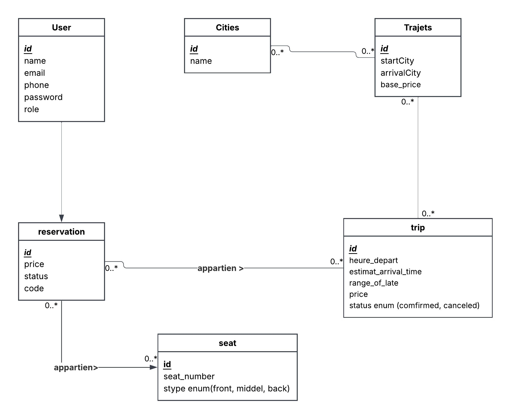

# TaxiYa — Plateforme de Réservation de Grands Taxis (MVP)

**TaxiYa** est une plateforme web qui digitalise la réservation des **grands taxis** :
les voyageurs recherchent un trajet, réservent une place, et les chauffeurs publient et gèrent leurs trajets.
Le projet est construit avec **Laravel** (PHP) et une architecture claire orientée **roles** (passenger / driver / admin).

---

## Table of Contents

* [Project Overview](#project-overview)
* [Key Features](#key-features)
* [Roles & Access](#roles--access)
* [Routes Overview](#routes-overview)
* [Database Overview](#database-overview)
* [Tech Stack](#tech-stack)
* [Installation & Setup](#installation--setup)
* [Seeding](#seeding)
* [Running the App](#running-the-app)
* [Project Structure](#project-structure)
* [Screenshots](#screenshots)
* [Roadmap](#roadmap)
* [License](#license)

---

## Project Overview

TaxiYa vise à rendre la réservation de grands taxis **simple**, **rapide** et **claire** :

* Rechercher un trajet (départ, arrivée, date)
* Consulter les résultats (prix/place, horaires)
* Réserver une place (MVP)
* Espace Chauffeur : publier et gérer des trajets
* Espace Admin : gestion/validation (MVP)

Le projet est conçu pour être **mobile-first** avec une UI propre (Blade + Tailwind).

---

## Screenshots





---
## Key Features

### Voyageur (Passenger)

* Recherche de trajets par villes + date
* Page résultats avec trajets disponibles
* “Mes réservations” (accès après connexion)
* Authentification simple (login/logout/register)

### Chauffeur (Driver)

* Inscription chauffeur dédiée
* Dashboard chauffeur
* Création de trajets (départ/arrivée/date/heure/prix/place + paramètres)
* Liste de trajets / réservations (MVP)

### Admin

* Dashboard admin (MVP)
* Gestion des chauffeurs (approbation/rejet) (MVP)

---

## Roles & Access

L’application utilise **un seul système d’auth (web guard)** avec un champ `role` dans `users` :

* `passenger` : voyageur standard
* `driver` : chauffeur (accès `/driver/*`)
* `admin` : administrateur (accès `/admin/*`)

### Middleware (RBAC)

* `auth` : utilisateur connecté
* `role:driver` : uniquement chauffeur
* `role:admin` : uniquement admin

---

## Routes Overview

### Public

* `GET /` → Home
* `GET /trips/search` → Search page
* `GET /trips/results` → Results page
* `GET /trips/{trip}` → Trip details

### Auth (one login/logout)

* `GET /login` → login form
* `POST /login` → login submit
* `DELETE /logout` → logout

### Register

* Passenger:

  * `GET /register`
  * `POST /register`
* Driver:

  * `GET /driver/register`
  * `POST /driver/register`

### Driver Area (protected)

* `/driver/dashboard`
* `/driver/trips`
* `/driver/trips/create`
* `/driver/bookings`

### Admin Area (protected)

* `/admin/dashboard`
* `/admin/drivers/pending`
* `/admin/drivers/{driver}`
* approve/reject actions (MVP)

---

## Database Overview

### Main Tables (MVP)

* `users` : comptes (role: passenger/driver/admin)
* `cities` : villes
* `routes` : start_city_id → arrival_city_id
* `taxis` : véhicule (model, color, licence_plate)
* `trips` : trajets (date, hours, price, route_id, taxi_id, status)
* `reservations` (+ pivot seats si besoin) (MVP)

### Example Business Rules

* A trip is attached to a route + taxi
* Search results filter by route + date + status
* Role-based access controls dashboards & actions

---

## Tech Stack

* **Laravel 12** (PHP)
* **Blade** for templates
* **TailwindCSS** for UI
* **MySQL** for database
* **Git/GitHub** for collaboration

---

## Installation & Setup

### Prerequisites

```bash
PHP >= 8.2
Composer
Node.js + npm
MySQL
```

### 1) Clone

```bash
git clone https://github.com/kara7z/TaxiYa---Plateforme-de-Reservation-de-Grands-Taxis.git
cd TaxiYa---Plateforme-de-Reservation-de-Grands-Taxis
```

### 2) Install dependencies

```bash
composer install
npm install
```

### 3) Environment

```bash
cp .env.example .env
php artisan key:generate
```

### 4) Configure database in `.env`

```env
DB_CONNECTION=mysql
DB_HOST=127.0.0.1
DB_PORT=3306
DB_DATABASE=taxiya
DB_USERNAME=root
DB_PASSWORD=
```

### 5) Run migrations

```bash
php artisan migrate
```

---

## Seeding

TaxiYa includes seeders for cities, routes, users, taxis, seats, trips (MVP).

```bash
php artisan db:seed
```

> If you want to reset everything safely:

```bash
php artisan migrate:fresh --seed
```

---

## Running the App

### Dev server

```bash
php artisan serve
```

### Front assets (Vite)

```bash
npm run dev
```

Open:

* `http://127.0.0.1:8000`

---

## Project Structure

```text
app/
  Http/
    Controllers/
      Auth/
      TripSearchController.php
    Middleware/
      RoleMiddleware.php
resources/
  views/
    pages/
    driver/
    admin/
    auth/
routes/
  web.php
database/
  seeders/
  migrations/
```

---

## Roadmap

* [ ] Real booking flow (create/cancel/confirm)
* [ ] Seats availability + real-time counts
* [ ] Driver validation workflow (admin approval)
* [ ] Password reset + email verification
* [ ] Notifications (email/SMS)
* [ ] API + mobile app support

---

## License

This project is for educational / training purposes.
© 2026 **TaxiYa**. All rights reserved.
